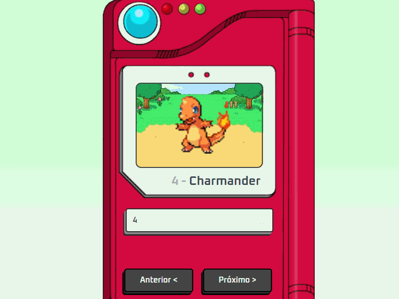

#                         Projeto Pokédex

Uma Pokédex utilizando API do https://pokeapi.co/

## Pokédex

  

## 🚀 Tecnologias

- HTML
- CSS
- JavaScript

#### 💻 Projeto para estudos ministrado pelo @manualdodev

 - [Manual do Dev](https://github.com/manualdodev)
